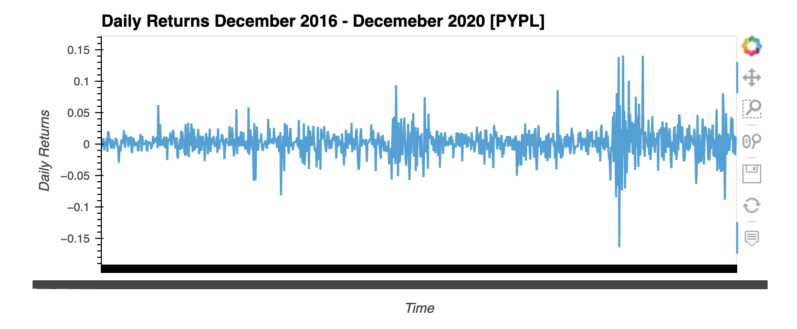

# ETF Portfolio Analysis December 2016 - December 2020

The notebook is an analysis of a portfolio holding ETF stocks from the trading days between December 2016 through December 2020.

---

## Technologies

Python 3.9

* [numpy](https://numpy.org/)
* [pandas](https://pandas.pydata.org/docs/getting_started/overview.html) 
* [hvplot](https://hvplot.holoviz.org/)
* [sqlalchemy](https://www.sqlalchemy.org/)

---

## Installation Guide

```python
  pip install numpy
  pip install pandas
  pip install hvplot
  pip install sqlalchemy
```

---

## Usage

This notebook uses a database that contains all of the information in a portfolio containing ETF stocks. The analysis includes visualizations and calculations.


---

## Contributors

Main contributer **Santiago Hernandez**
- [dsmannight@gmail.com](dsmannight@gmail.com)

---

## License

This application is free for non-profit use.
